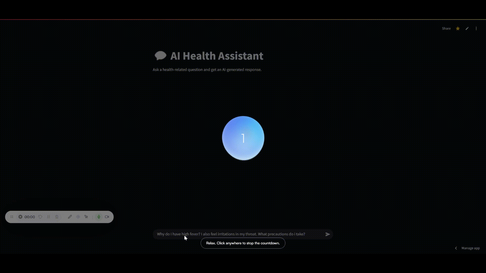
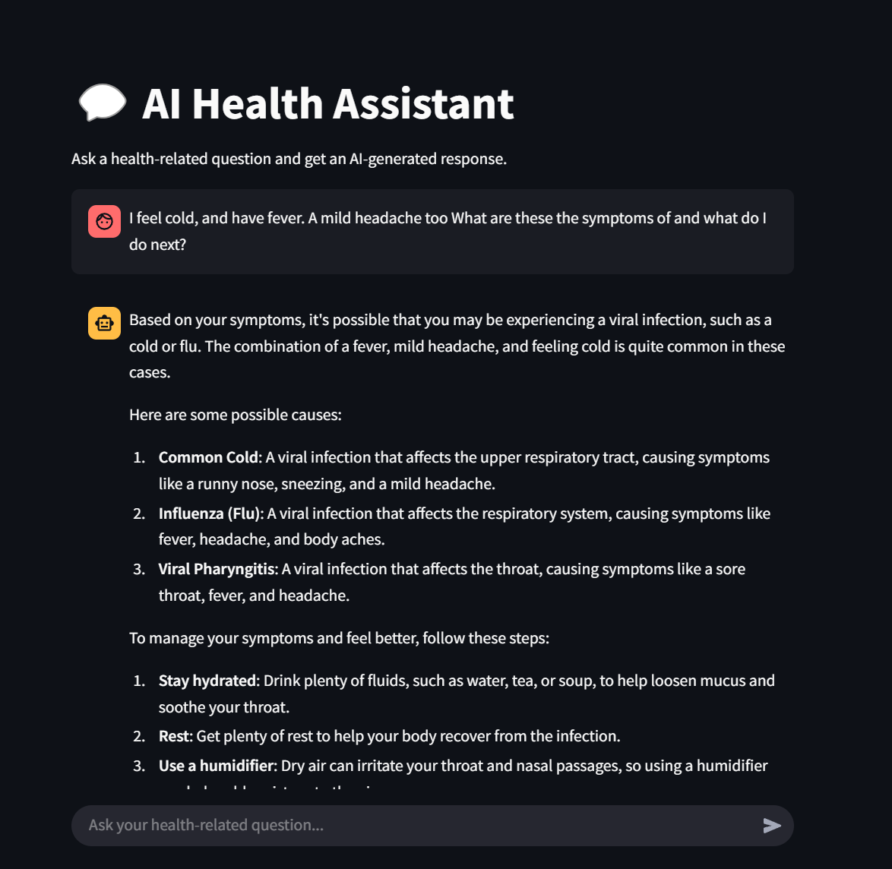
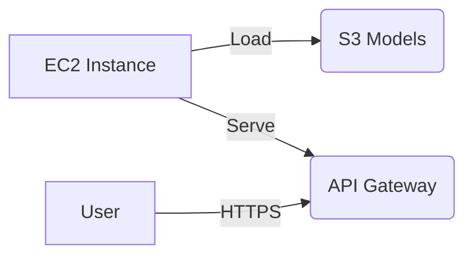
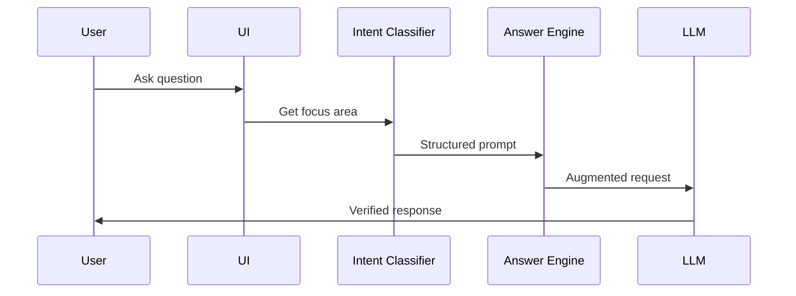

# MediChat-AI: Healthcare LLM Assistant

[](https://ai-health-chatbot.streamlit.app/)


An AI-powered healthcare chatbot combining **Llama 3.1** for generation and **DistilBERT** for intent classification, deployable via Streamlit/Flask or AWS infrastructure.

## Demo



## Features
- 🩺 **Medical-Specific Responses**: Context-aware healthcare answers
- 🧠 **Dual-Model Pipeline**:
  - Intent classification (DistilBERT)
  - Answer generation (T5/Llama-3)
- 🚀 **Flexible Deployment**:
  - Streamlit prototype
  - Flask REST API
  - AWS EC2 + S3 (production)

## Quick Start
```bash
git clone https://github.com/yourusername/MediChat-AI.git
cd MediChat-AI
pip install -r requirements.txt

# Set API key (get from https://together.ai)
echo "TOGETHER_API_KEY=your_key_here" > .env

# Run Streamlit demo
streamlit run app.py
```

## Project Structure
```
├── app.py                # Streamlit interface
├── chatbot_webapp.py     # Flask API
├── llm.py                # Together.ai LLM wrapper
├── requirements.txt      # Python dependencies
├── /models               # For local model storage
│   ├── intent_classifier_minimal
│   └── generator_minimal
```

## Deployment Options

### 1. Local Development
```bash
streamlit run app.py  # Demo on http://localhost:8501
python chatbot_webapp.py  # Flask API on :5000
```

### 2. AWS Production

**Requirements**:
- EC2 instance (GPU recommended)
- S3 bucket for models
- IAM roles with S3 access

*⚠️ AWS configuration not included - set your own credentials*

## Architecture


## Contributing
1. Fork the repository
2. Create your feature branch (`git checkout -b feature/amazing-feature`)
3. Commit changes (`git commit -m 'Add feature'`)
4. Push (`git push origin feature/amazing-feature`)
5. Open a Pull Request

## License
Apache 2.0 - See [LICENSE](LICENSE)
```
